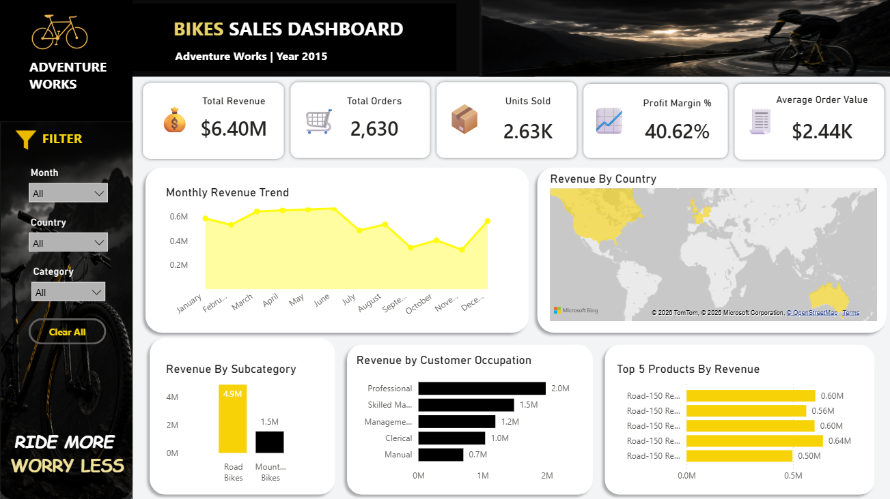

# 📊 Sales Performance Analysis using Power BI

> **An end-to-end Business Intelligence project demonstrating data preparation with Excel Power Query, data modeling, KPI reporting, and interactive dashboard development using the Microsoft Adventure Works dataset.**

---

# 📸 Dashboard Preview

<p align="center">
  
</p>

---

# 📌 Project Overview

This project focuses on analyzing sales performance by transforming raw transactional data into an interactive Power BI dashboard. Using Excel Power Query, multiple sales datasets and business dimension tables were consolidated into a centralized reporting dataset, enabling efficient KPI monitoring and business analysis.

---

# ❗ Business Problem

The business maintained sales data across multiple yearly files and related business tables, making reporting repetitive, time-consuming, and prone to manual errors.

Management required a centralized reporting solution to:

- Consolidate sales data into a single reporting model.
- Automate repetitive data preparation.
- Monitor key business KPIs.
- Analyze sales performance across products, countries, and time periods.
- Support faster business decision-making.

---

# 🎯 Business Objectives

- Consolidate multiple datasets into a master reporting table.
- Automate data preparation using Excel Power Query.
- Build an interactive Power BI dashboard.
- Track business KPIs.
- Analyze product, regional, and monthly sales performance.
- Improve reporting efficiency and accuracy.

---

# 📂 Dataset

**Source:** Microsoft Adventure Works Sample Dataset

### Fact Tables

- Fact Sales
- Fact Returns

### Dimension Tables

- Customers
- Products
- Product Categories
- Product Subcategories
- Calendar
- Territories

---

# ⚙️ Project Workflow

```text
Raw CSV Files
      │
      ▼
Excel Power Query
      │
      ▼
Append Sales Tables
      │
      ▼
Merge Dimension Tables
      │
      ▼
Master Reporting Dataset
      │
      ▼
Power BI Dashboard
```

---

# 📊 Dashboard KPIs

- 💰 Total Revenue
- 💵 Total Profit
- 📉 Total Cost
- 📦 Total Orders
- 🛒 Quantity Sold
- 👥 Total Customers
- 💳 Average Order Value
- 📈 Profit Margin

---

# 📈 Key Insights

- Generated **₹64.05 Lakhs** in total revenue with a **40.62% profit margin**.
- **Road Bikes** contributed over **76%** of total revenue, making them the highest-performing product category.
- **Australia** generated the highest regional revenue, followed closely by the **United States**.
- Sales remained stable throughout the year, with **June** recording the highest monthly revenue.
- **Road-150 Red** product variants were the top revenue-generating products.
- Interactive filters enable detailed analysis by product, category, country, and reporting period.

---

# 💡 Business Recommendations

- Increase inventory for high-performing Road Bike models.
- Expand marketing initiatives in top-performing regions.
- Improve sales strategies for Mountain Bikes.
- Monitor seasonal sales trends for better inventory planning.
- Continue automated reporting to improve reporting efficiency and reduce manual effort.

---

# 🖥 Dashboard Highlights

✔ Executive KPI Cards

✔ Monthly Sales Trend

✔ Revenue by Category

✔ Revenue by Country

✔ Top Selling Products

✔ Interactive Filters

---

# 🛠 Tools & Technologies

- Microsoft Excel
- Power Query
- Power BI
- DAX
- AUTOMATION 
- VBA(REFRESH-DATA)

---

# 📦 Project Deliverables

- Cleaned & transformed reporting dataset
- Master Excel reporting table
- Interactive Power BI dashboard
- Daily/Weekly/Monthly reporting workflow
- Business performance analysis

---

# 💼 Skills Demonstrated

- Data Cleaning
- Data Transformation
- Power Query ETL
- Data Modeling
- Dashboard Development
- KPI Reporting
- Business Intelligence
- DAX
- Data Visualization
- Business Reporting

---

# ✅ Project Outcome

Developed a centralized reporting solution that automates data preparation and provides an interactive dashboard for monitoring sales performance. The project demonstrates a practical reporting workflow commonly used by Data Analysts and MIS Analysts.

---

## ⭐ If You Found This Project Interesting

If you found this project useful, consider giving the repository a ⭐.

---

# 👨‍💻 Author

**Raj Thakare**

** Data Analyst | MIS Analyst**

**Skills:** Excel • SQL • Power BI • Power Query • DAX

**GitHub:** https://github.com/your-username
